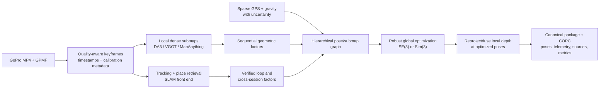

# Reconstruction methods and execution research

Status: **research recommendation**
Date: 2026-07-26
Scope: GoPro-only and GoPro-plus-sparse-GNSS reconstruction, kilometre-scale
single-session consistency, cross-session/global alignment, and remote GPU
execution.

Implementation update (2026-07-29): the follow-up work in
[`reconstruction_followup_tasklist.md`](reconstruction_followup_tasklist.md)
added and registered DA3-Streaming, VGGT-Long, MASt3R-SLAM, and VGGT-Ω
adapters; pinned all external revisions; changed VGGT/DA3 scale claims to
relative; disabled the misleading `orb_slam` control by default; and propagated
exact normalized source-frame identities through every adapter. The detailed
"current inventory" below is retained as the pre-implementation audit that
motivated those corrections.

## Executive recommendation

Mapper should not replace the current window aligner with one new foundation
model and expect the long-range problem to disappear. The best next design is a
**hierarchical reconstruction pipeline**:

1. select useful keyframes and preserve their exact video timestamps;
2. reconstruct bounded local submaps with a recent dense model;
3. create a graph containing sequential submap constraints, visually verified
   loop closures, cross-session matches, gravity, and whatever GPS observations
   are actually valid;
4. optimize that graph globally;
5. regenerate/fuse dense geometry using the optimized poses; and
6. publish the result through the existing reconstruction-package/COPC path.

The first implementation candidate should be **DA3-Streaming**, because it
already targets ultra-long videos, has released code, can operate near the
available memory tier, includes loop closure, and already has an adapter stub in
this repository. The first comparison should be **VGGT-Long**, because it is
the closest published match to Mapper's kilometre-scale use case. Add
**MASt3R-SLAM** as the trajectory/loop-closure control. It is a real dense SLAM
system; Mapper's current `orb_slam` class is not.

The likely production workflow is ultimately two-pass:

- a keyframe SLAM/pose-graph pass for globally consistent camera poses; then
- confidence-aware dense reconstruction per optimized submap, using DA3,
  MapAnything, VGGT-Ω, or the best later model.

This separation lets Mapper upgrade dense geometry without replacing global
alignment. It also fits the existing model-agnostic package contract.

For execution, begin with **Modal plus a provider-neutral object store
(Cloudflare R2)**. It is the smallest operational step from the accepted
"pluggable remote GPU runner" boundary. Keep Runpod as a cost control and use
AWS Batch Spot only if job volume makes its additional control-plane work
worthwhile.

## What the existing evidence says

The repository's real captures already isolate the main failure modes:

| Capture/artifact | Evidence | What it implies |
| --- | --- | --- |
| Kings Canyon `kings_canyon_2` | 25,667,473 points, 719 poses, 18 MUSt3R windows; 14,533 IMU samples; no GPS sample passed the 3D-fix/quality gates | A no-GPS capture must remain useful in a stable local frame and later acquire a world anchor from visual cross-session matches or sparse external observations. |
| Tahoe Ridge `tahoe_ridge_2` | 17,000,000 points, 2,716 VGGT poses, 340 windows; 4,931 valid GPS samples over about 482 m | The input has enough GPS observations, but the reconstructed trajectory is not globally compatible with them. |
| Tahoe alignment result | metric-scale-locked fit rejected at 103.987 m RMSE, 93.637 m median residual, despite a 0.9845 robust inlier fraction | This is a systematic trajectory/alignment mismatch, not a few GPS outliers. A final whole-map transform cannot remove accumulated window drift, a pose convention defect, or a bad trajectory shape. |
| `mp7` legacy result | 146,911,634 MUSt3R points from 43 windows; non-metric; legacy GPS/IMU were discarded after the run | The new package/provenance path fixed the auditability problem, but the reconstruction backend is still a sequential window chain. |

The full evidence is recorded in
[`phase0_spike_findings.md`](phase0_spike_findings.md) and
[`phase2_implementation_log.md`](phase2_implementation_log.md).

The immediate research question is therefore not "which model produces the
prettiest local point cloud?" It is:

> Which front end plus global back end minimizes drift per kilometre, preserves
> usable geometry under forest/trail imagery, accepts sparse world constraints,
> and still publishes within bounded GPU, RAM, disk, and dollar budgets?

## Current model and algorithm inventory

There are **four** registered model adapters. Only three are substantially
implemented inside this repository, and one of those three has a misleading
name.

### VGGT

Repository path: [`src/models/vggt.py`](../src/models/vggt.py)  
Config: [`configs/models/vggt.yaml`](../configs/models/vggt.yaml)  
Dependency: `facebookresearch/vggt` pinned at commit
`44b3afbd1869d8bde4894dd8ea1e293112dd5eba`.

What the adapter does:

- loads `facebook/VGGT-1B`;
- predicts camera extrinsics/intrinsics, depth or point maps, RGB, and
  confidence;
- marks the resulting point cloud metric;
- slices long input into independent overlapping windows;
- returns per-window poses and dense points for the generic `WindowAligner`;
- supports a repository-specific mixed-float16 aggregator mode for an 8 GiB
  GPU.

Current acceptance configuration is deliberately small: 20-frame windows,
4-frame overlap, 168-pixel square input, and at most 50,000 points per window.
That is a smoke/acceptance profile, not a production-quality trail profile.

Important limitations:

- the `outputs_metric_scale` claim is still annotated "to verify with testing";
- independent-window inference has no persistent map state;
- no loop closure is emitted;
- a window is connected only to its immediate predecessor;
- current code uses every sampled frame rather than a motion/quality-based
  keyframe policy; and
- the upstream model is already superseded by VGGT-Ω for bounded scenes and by
  VGGT-Long/VGGT-SLAM for long sequences.

Upstream VGGT remains a useful baseline. Its May 2026 memory fix reportedly
allows roughly 2–3 times more frames at the same memory budget, and the
[official VGGT repository](https://github.com/facebookresearch/vggt) now
documents the distinction between its original non-commercial checkpoint and
the commercial-use checkpoint.

### MUSt3R

Repository path: [`src/models/must3r.py`](../src/models/must3r.py)  
Config: [`configs/models/must3r.yaml`](../configs/models/must3r.yaml)  
Dependency: `naver/must3r`; the current lock resolves commit
`5b63804021789b7dc79313dfbe588671b1b074e2`.

The spelling matters:

- **MUSt3R** is the Naver multi-view memory model used here.
- **MASt3R** is a different two-view reconstruction/matching prior.
- **MASt3R-SLAM** is a SLAM system built on MASt3R and is not currently
  imported.

What the Mapper adapter does:

- runs the upstream reconstruction scene path;
- keeps dense points, colors, and confidence in memory rather than
  round-tripping through thresholded PLY files;
- returns camera-to-world poses;
- marks scale non-metric; and
- slices input into independent windows before generic alignment.

The production Kings Canyon profile uses 50-frame windows, 10-frame overlap,
30 memory images, and frame subsampling by two. The generic model config still
contains a much larger 500-frame default.

The [official MUSt3R repository](https://github.com/naver/must3r) now includes
an online visual-odometry demo and describes a persistent memory/keyframe
workflow. Mapper currently bypasses that full online workflow by resetting the
scene at each generic window. The upstream
[CVPR 2025 paper](https://openaccess.thecvf.com/content/CVPR2025/html/Cabon_MUSt3R_Multi-view_Network_for_Stereo_3D_Reconstruction_CVPR_2025_paper.html)
also calls out drift when views move too far from the first view. Finally, its
code and checkpoints are non-commercial and inherit restrictive training-data
terms; that must remain in experiment provenance.

### `orb_slam` (actually simplified visual odometry)

Repository path: [`src/models/orb_slam.py`](../src/models/orb_slam.py)  
Config: [`configs/models/orb_slam.yaml`](../configs/models/orb_slam.yaml)

This is not ORB-SLAM, ORB-SLAM2, or ORB-SLAM3. It is a small Python/OpenCV
visual-odometry prototype:

- ORB features and adjacent-frame matching;
- essential-matrix relative pose;
- pairwise triangulation;
- a sparse colored cloud and pose chain.

It has no map reuse, keyframe graph, relocalization, covisibility graph, bundle
adjustment, loop closure, or multi-session map merge. The class docstring lists
some of those as optional concepts, but they are not implemented.

There is also a correctness hazard: `_estimate_scale_from_imu()` is a TODO that
returns `1.0`, while the caller can mark the cloud metric whenever
`use_imu: true`. The Kings Canyon config currently enables that flag. Until a
real visual-inertial estimator exists, this adapter must not be accepted as a
metric baseline.

The genuine [ORB-SLAM3](https://github.com/UZ-SLAMLab/ORB_SLAM3) supports
monocular, monocular-inertial, pinhole/fisheye, loop closure, and multiple map
merge. It is a useful CPU/classical control if GoPro image and IMU calibration
can be established, but it is GPLv3, its current release is from 2021, and it
does not produce the desired dense reconstruction by itself.

### DA3-Streaming adapter

Repository path:
[`src/models/da3_streaming.py`](../src/models/da3_streaming.py)  
Config:
[`configs/models/da3_streaming.yaml`](../configs/models/da3_streaming.yaml)

This registered adapter is integration scaffolding around an external
Depth-Anything-3 checkout. It invokes `da3_streaming.py`, then reads
`camera_poses.txt`, `intrinsic.txt`, and `pcd/combined_pcd.ply`.

It is not yet a trusted adapter:

- no DA3 revision or weights are pinned in this repository;
- pose convention is accepted without explicit conversion/validation;
- timestamps are truncated to output length rather than matched through an
  exported frame-index table;
- it asserts metric scale with a "to verify" comment;
- the capability says confidence is available, but the combined-PLY path does
  not explicitly preserve per-point confidence; and
- it imports one fully combined PLY, defeating the preferred source-unit,
  bounded-memory publisher path.

Those are adapter tasks, not reasons to reject DA3. The
[official DA3-Streaming documentation](https://github.com/ByteDance-Seed/Depth-Anything-3/blob/main/da3_streaming/README.md)
is unusually close to Mapper's problem: long video, large scenes, chunk
streaming, loop closure, camera poses, intrinsics, confidence/depth sidecars,
and combined geometry. It also explicitly says the pipeline is **not itself a
SLAM system**, which is why Mapper still needs its own graph and validation
boundary.

### Current alignment backend

Repository path:
[`src/alignment/window_aligner.py`](../src/alignment/window_aligner.py)

For each adjacent pair of windows, it:

1. finds overlapping frame indices;
2. solves one unweighted SE(3) or Sim(3) transform from overlapping camera
   positions;
3. optionally falls back to point-to-plane ICP; and
4. composes the pairwise transform into the window-0 frame.

This is a chain, not a graph. It has no uncertainty, robust kernel on overlap
poses, non-adjacent edges, loop candidates, joint optimization, or
cross-session constraints. A bad early edge contaminates every later window.
ICP starts at identity unless the optional RANSAC initializer is enabled, so it
is a local fallback rather than a robust global registration strategy.

The GPS aligner is substantially better engineered: timestamp pairing, clock
offset search, quality weights, robust fitting, rejection gates, and explicit
alignment results. It intentionally ignores raw GoPro gravity unless a valid
sensor-to-model-frame direction is supplied. The next backend should preserve
those guardrails but express GPS and gravity as graph factors, not only as one
final transform.

## 2025–2026 method survey

### Primary candidates

| Method | Why it matters to Mapper | Readiness and concern | Recommendation |
| --- | --- | --- | --- |
| [DA3-Streaming](https://github.com/ByteDance-Seed/Depth-Anything-3/blob/main/da3_streaming/README.md) | Chunked long-video reconstruction, loop closure, poses, intrinsics, depth/confidence, official claim of ultra-long inference; Apache-2.0 code. | Official KITTI tests show 8.51 FPS on an A100 excluding warm-up/model load/PLY save. Peak memory depends heavily on aspect ratio and chunk size: 11.5 GB for 30 wide KITTI frames but 18.7 GB for 30 TUM frames. It is a reconstruction pipeline, not a complete SLAM back end. | **Integrate and benchmark first.** Export submaps and constraints instead of accepting only its final PLY. |
| [VGGT-Long](https://github.com/DengKaiCQ/VGGT-Long) | Explicitly targets kilometre-scale, unbounded RGB sequences using chunks, overlap alignment, retrieval, and loop correction. Runs on a tested RTX 4090 with 24 GiB. | ICRA 2026 code is available, but disk use is large: the project reports about 50 GiB scratch for 4,500 KITTI frames. Its own guidance notes drift with overly dense frames and motion blur. | **Benchmark second and reuse its graph/loop ideas.** It is the closest direct comparison to the current pipeline. |
| [MASt3R-SLAM](https://openaccess.thecvf.com/content/CVPR2025/html/Murai_MASt3R-SLAM_Real-Time_Dense_SLAM_with_3D_Reconstruction_Priors_CVPR_2025_paper.html) | A real monocular dense SLAM system with pointmap matching, tracking, local fusion, a graph, loop closure, and global second-order optimization; accepts uncalibrated/non-parametric central cameras. | Released implementation was evaluated on an RTX 4090 and processes MP4 or image folders. It is relative-scale unless constrained and brings a separate MASt3R dependency/license chain. | **Use as trajectory and loop-closure control.** If its poses beat DA3, test DA3/MapAnything densification conditioned on them. |
| [VGGT-SLAM 2.0](https://github.com/MIT-SPARK/VGGT-SLAM) | Incrementally aligns VGGT submaps in a factor graph and uses VGGT attention features to verify retrieval/loop candidates. The 2026 version removes the 15-DoF drift problem of v1. | Released BSD-2-Clause system; RSS 2026. Its public examples are still much smaller and more indoor-oriented than Mapper trails. Upstream VGGT weight terms still apply. | **High-value graph experiment**, especially because Mapper already has a VGGT adapter. Do not assume kilometre-scale performance without a trail test. |
| [MapAnything](https://map-anything.github.io/) | Produces metric geometry and can ingest optional intrinsics, poses, depth, or partial reconstruction. That makes it well suited to second-pass densification after pose-graph optimization. | 3DV 2026, code/model available under Apache terms. Feed-forward context is bounded; no kilometre-scale global back end is provided. | **Test as a bounded submap densifier**, not as the global system. |

### Strong bounded-scene or research-track models

| Method | Relevant advance | Why it is not the first integration |
| --- | --- | --- |
| [VGGT-Ω](https://github.com/facebookresearch/vggt-omega) | CVPR 2026 model from the VGGT team with better static/dynamic reconstruction and much better memory scaling. Official A100 measurements rise from 6.02 GB for one frame to 43.15 GB for 500 frames. | Excellent bounded-window candidate, but it still needs chunk/graph/loop machinery for a multi-kilometre trail. Checkpoint access and license are gated/non-commercial. |
| [CUT3R](https://openaccess.thecvf.com/content/CVPR2025/html/Wang_Continuous_3D_Perception_Model_with_Persistent_State_CVPR_2025_paper.html) | Persistent recurrent state and metric pointmaps in a common frame for continuous video. | Persistent state reduces window resets but does not by itself supply robust long-range loop closure or a cross-session graph. |
| [SLAM3R](https://github.com/PKU-VCL-3DV/SLAM3R) | Real-time feed-forward dense scene reconstruction from monocular video without explicitly estimating cameras; online code released. | Mapper needs authoritative camera poses for GPS, provenance, cross-session factors, and drift metrics. A system that does not explicitly expose them is a poorer architectural fit. |
| [LONG3R](https://openaccess.thecvf.com/content/ICCV2025/html/Chen_LONG3R_Long_Sequence_Streaming_3D_Reconstruction_ICCV_2025_paper.html) | Recurrent spatio-temporal memory and streaming reconstruction. | The paper defines its long setting as tens to hundreds of frames and acknowledges the absence of loop-closure/post-optimization machinery. Mapper needs thousands to tens of thousands of keyframes. |
| [MegaSaM](https://openaccess.thecvf.com/content/CVPR2025/html/Li_MegaSaM_Accurate_Fast_and_Robust_Structure_and_Motion_from_Casual_CVPR_2025_paper.html) | Robust pose and depth for casual dynamic videos, weak parallax, unknown field of view, and complex motion. | Valuable robustness control if hikers/vegetation dominate failures, but its core target is dynamic casual video rather than static, globally registered outdoor mapping. |
| [S3PO-GS](https://openaccess.thecvf.com/content/ICCV2025/html/Cheng_Outdoor_Monocular_SLAM_with_Global_Scale-Consistent_3D_Gaussian_Pointmaps_ICCV_2025_paper.html) and [MAGiC-SLAM](https://openaccess.thecvf.com/content/CVPR2025/html/Yugay_MAGiC-SLAM_Multi-Agent_Gaussian_Globally_Consistent__SLAM_CVPR_2025_paper.html) | Outdoor scale-consistent Gaussian pointmaps and globally consistent multi-agent Gaussian map merging. | Useful research for a later splat representation. Today Mapper needs measurable, confidence-bearing geometry and COPC publication more than novel-view photorealism. |

### Emerging 2026 watch list

These are relevant but too new to make the first experiment gate:

- [Scal3R](https://arxiv.org/abs/2604.08542) targets ultra-large scenes with
  test-time-trained global context and reports KITTI/Oxford Spires results.
- [CoMo3R-SLAM](https://arxiv.org/abs/2605.30488) directly studies
  cross-agent outdoor monocular map fusion using pointmap verification, Sim(3)
  synchronization, and global bundle adjustment.
- [PAS3R](https://arxiv.org/abs/2603.21436) adapts persistent-state updates to
  camera motion and long-horizon trajectory stability.

Their ideas should be revisited after the first Mapper benchmark exists. A
paper result cannot substitute for released code, reproducible weights, license
review, and a GoPro trail run.

## Recommended reconstruction architecture



### 1. Capture normalization and keyframes

Do not send ten nearly identical hiking frames per second through the
reconstructor. VGGT-Long's own field guidance reports that very dense input can
increase drift. Start with a 1–2 FPS control, then replace fixed-rate sampling
with a deterministic keyframe selector:

- reject severe blur, corrupt decode, and extreme exposure;
- retain a frame after sufficient image motion/baseline or elapsed time;
- retain extra frames at sharp turns and when the current map overlap falls;
- keep occasional retrieval-only frames even if they are not densified; and
- preserve `frame_index`, exact video timestamp, exposure, and selection reason.

Record at a high camera frame rate when light permits to reduce motion blur,
but reconstruct only selected keyframes. This separates capture quality from
model workload.

Treat camera settings as part of calibration. GoPro's
[GPMF format](https://github.com/gopro/gpmf-parser) supplies time-indexed IMU,
orientation, exposure, and GPS metadata. Lens mode, resolution, crop, and
HyperSmooth mode must be recorded per capture. Electronic stabilization changes
the image warp/crop; compare a calibrated low-distortion profile against the
normal stabilized field profile rather than assuming one camera matrix fits
both.

Add one deliberate capture habit: at the trailhead, record a slow 15–30 second
multi-direction sweep or small loop, and repeat it at return. This provides
several high-overlap, high-parallax keyframes for both loop closure and
cross-session alignment at almost no hardware cost.

### 2. Local submaps

Submaps should be immutable local reconstructions with:

- point/depth maps in a declared camera/submap frame;
- camera poses and per-frame intrinsics;
- confidence;
- exact source frame indices/timestamps;
- the model's sequential relative constraint and uncertainty/quality; and
- enough retained descriptors/correspondences to verify a later loop.

Do not make `combined_pcd.ply` the adapter boundary. It loses the structure
needed to re-optimize. The canonical publisher can still consume each submap as
a source unit after graph optimization.

Use SE(3) between submaps only when metric scale is empirically validated.
Otherwise optimize Sim(3). A model's README or class flag is not sufficient
evidence to lock scale.

### 3. Global graph, not a transform chain

Create graph nodes for keyframes or bounded submaps and edges for:

- adjacent tracking/submap overlap;
- non-adjacent same-session loop closures;
- inter-session/trailhead matches;
- GPS positions with horizontal and vertical covariance;
- gravity/roll-pitch after camera-to-IMU calibration; and
- optional known-map controls such as independently validated 3DEP/DEM matches.

Use image/place retrieval to propose loops, then require geometric verification
from dense pointmap matches or 2D–3D correspondences. Use a robust estimator and
an inlier/spatial-coverage gate before adding the edge. Raw point-cloud ICP
should be a final local refinement after a verified initializer, not the method
that discovers whether two forest submaps correspond.

Optimize all accepted edges jointly with robust loss or switchable constraints.
[GTSAM](https://github.com/borglab/gtsam) is a practical backend: it provides
factor-graph optimization, GPS factors, IMU preintegration, similarity
geometry, and now the SL(4) support used by VGGT-SLAM. Pin a stable release
rather than the API-breaking development branch.

After optimization, rebuild the global dense cloud from original local
depth/point maps and optimized camera/submap poses. Do not repeatedly resample
already transformed global point clouds; that compounds blur and makes later
graph corrections difficult.

### 4. Cross-session/global map alignment

Keep one site-level graph above individual run graphs:

```text
site graph
  trailhead/world anchor
  ├── run A submap graph
  ├── run B submap graph
  └── run C submap graph
```

For a new run:

1. use approximate GPS/site metadata only to narrow the candidate set when it
   exists;
2. retrieve visually similar keyframes from earlier sessions;
3. verify several trailhead image pairs geometrically;
4. estimate a robust SE(3)/Sim(3) inter-run constraint;
5. add multiple inter-run edges to the site graph; and
6. jointly optimize while keeping the reviewed world anchor fixed.

This aligns the actual maps, not just their first coordinates. A single
trailhead point can co-locate two maps but cannot determine all orientation and
scale degrees of freedom.

Season, lighting, direction of travel, and foliage can break appearance
retrieval. The deliberate trailhead sweep provides multiple headings and
baselines. If routes share any initial trail segment, retain several
cross-session constraints along that segment rather than collapsing them into
one start transform.

### 5. What sparse GPS can and cannot do

| Available world information | Observable result |
| --- | --- |
| GoPro RGB only | Relative trajectory and geometry. Absolute latitude/longitude and global yaw are unobservable. Learned "metric" scale is a prior that must be measured, not assumed survey truth. |
| RGB + calibrated gravity | Roll/pitch become constrained; position, yaw, and possibly scale remain free. |
| One GPS position | Adds a translation anchor. It does not determine yaw or scale. |
| Two well-separated GPS positions + gravity | Constrains route direction/yaw; if reconstruction scale is free, their separation also constrains scale. |
| Three or more good, separated GPS positions | Enables robust fitting and outlier detection. Geometry is still weak if every point is clustered at the trailhead. |
| Sparse positions distributed along the route | Adds drift controls to the global graph and is much more valuable than the same count at the start. |
| Continuous quality GPS | Best world prior, but it must still be uncertainty-weighted and rejected during no-fix/high-DOP intervals. |

The fundamental limitation is important: **a few points only at the beginning
cannot correct drift kilometres later unless the visual graph has loops or
other global constraints**. No new foundation model changes that observability.

The best immediate test needs no new hardware: take Tahoe's 4,931 valid samples
and rerun the same graph while retaining `0, 1, 2, 4, 8, 16, full` GPS
observations, with the sparse samples spread by path length. That directly
measures the point at which an external logger becomes useful. Keep the
external-logger plan in
[`gps_logger_research.md`](gps_logger_research.md) as an optional accuracy
tier, not a prerequisite for the visual pipeline.

## Evaluation plan

### Test corpus

Use the same decoded keyframe sets across models:

1. **Kings Canyon no-GPS:** tests pure visual stability and later trailhead
   anchoring.
2. **Tahoe with valid GPS:** tests trajectory shape, clock pairing, sparse-GPS
   ablation, and alignment rejection.
3. **`mp7` large run:** tests out-of-core behavior and comparison with the
   146.9M-point legacy result.
4. **A short deliberate loop:** tests true loop closure and endpoint error.
5. **Two sessions from one trailhead:** tests visual inter-session merge.

Keep a short "fast" profile, but do not use its geometry quality to rank models.

### Metrics

Record metrics by distance travelled as well as by run:

| Area | Required metrics |
| --- | --- |
| Trajectory | relative pose error; endpoint/loop error; GPS ATE after robust alignment; drift as percent of path length; error versus distance; tracked/lost/relocalized intervals |
| Geometry | 3DEP/DEM point-to-surface error where available; repeated-route surface separation; local thickness/noise; completeness; seam error at submap boundaries |
| Loops | candidate count; verified count; false-positive count; spatial inlier coverage; pre/post optimization residual |
| Cross-session | trailhead transform residual; shared-segment separation; number and distribution of accepted inter-run edges |
| Scale/world | recovered scale; scale drift by segment; GPS residual by fix quality; result of `0/1/2/K/full` GPS ablation |
| Resources | GPU seconds, peak VRAM, peak RAM, scratch bytes, input/output bytes, point count before/after confidence and voxel filters |
| Cost | compute dollars, object-storage GB-days, transfer dollars, failed/retried work |

The winner should minimize global trajectory and geometry error under a fixed
compute profile. Visual appeal is a secondary score.

### Experiment sequence

#### R0 — Fix the controls

- make keyframe selection deterministic and persist its table;
- stop the current ORB adapter from declaring dummy IMU scale metric;
- add pose convention/unit tests to DA3;
- make every adapter export source frame indices and confidence;
- record capture lens/stabilization/resolution metadata.

#### R1 — Long-sequence front ends

Run:

- DA3-Streaming;
- VGGT-Long;
- current VGGT window chain; and
- MASt3R-SLAM trajectory control.

Use identical `1 FPS`, `2 FPS`, and quality-aware keyframes. Start with one
short loop and Tahoe before spending on the longest run.

#### R2 — Graph ablation

For the strongest front end compare:

1. adjacent-chain only;
2. graph with adjacent factors;
3. graph plus same-session loop closures;
4. graph plus full GPS;
5. graph plus sparse GPS ablations.

This separates model quality from backend quality.

#### R3 — Cross-session site graph

- record or select two captures with a common trailhead/shared segment;
- build a persistent retrieval index;
- require at least three geometrically verified inter-session keyframe pairs;
- optimize both run graphs under one site anchor;
- publish individual runs and an optional accepted composite without erasing
  provenance.

#### R4 — Dense second pass

Condition DA3 or MapAnything submaps on the best optimized poses/intrinsics if
their public APIs support it cleanly. Compare geometry against the front end's
native dense result. Then test VGGT-Ω as a higher-quality bounded densifier.

### Decision gates

Promote a workflow only if:

- no accepted loop is a visual false positive;
- loop closure improves, rather than merely changes, independent GPS/3DEP
  residuals;
- long-route drift is materially lower than the current chain;
- an unaligned run remains explicitly unaligned;
- all source frames/submaps remain traceable through publication;
- one failed submap can resume without rerunning the full video; and
- cost and scratch use are recorded automatically.

## Remote GPU execution

### Recommended job contract

Do not upload a multi-gigabyte MP4 in an RPC body. Use direct multipart object
upload and pass small object references through the runner:

```json
{
  "job_schema": 1,
  "capture_id": "opaque-id",
  "input": {
    "video_uri": "s3-compatible://bucket/captures/.../video.mp4",
    "video_sha256": "...",
    "telemetry_uri": "s3-compatible://bucket/captures/.../telemetry.json"
  },
  "model": {
    "name": "da3_streaming",
    "image_digest": "sha256:...",
    "weights_digest": "sha256:...",
    "config": {}
  },
  "output_prefix": "s3-compatible://bucket/jobs/opaque-id/",
  "resume_from": null
}
```

The remote sequence should be:

1. verify checksum and extract telemetry/keyframes;
2. run resumable submaps into local ephemeral scratch;
3. checkpoint graph/submap metadata after each accepted unit;
4. optimize;
5. run the existing canonical publisher next to the GPU job;
6. upload COPC plus small sidecars and metrics atomically; and
7. delete raw intermediate point/depth files after successful validation.

Only the compressed package returns to the local workstation. The local
control plane records `queued/running/publishing/validating/succeeded/failed`,
provider job ID, attempt, image/weights/config digests, logs, cost, and output
checksums. Submission must be idempotent on the job/input/config digest.

### Provider comparison

Prices below are public list prices observed **2026-07-26** and will change.
Benchmark actual end-to-end dollars; GPU hourly price alone is not the answer.

| Option | Current useful prices | Operational fit | Recommendation |
| --- | --- | --- | --- |
| [Modal](https://modal.com/pricing) | L40S $0.000542/s ($1.95/h); A100 40 GB $2.10/h; A100 80 GB $2.50/h; H100 $3.95/h. CPU and RAM bill separately. Starter includes $30/month compute. | Per-second scale-to-zero, custom images, batch calls, persistent volumes, S3/R2 mounts, budgets. Lowest integration burden. | **Start here.** Use L40S when it fits; fall back to A100 40/80 by measured VRAM. |
| [Runpod Serverless](https://www.runpod.io/pricing) | 48 GB L40/L40S/6000 Ada tier $1.75/h; A100 80 GB $2.72/h; H100 80 GB $4.55/h. Billed per second while starting, executing, and idling. | Familiar provider, custom workers, scale to zero. Cold/model load is billable; network volumes are $0.07/GB-month below 1 TB. | Keep as the direct comparison. It can beat Modal for the 48 GB tier, but not necessarily for A100 after cold start. |
| Runpod Pods | L40S $0.99/h; A100 PCIe 80 GB $1.39/h; RTX 4090 $0.69/h at the listed rates. | Much cheaper for multi-hour work, but lifecycle, retries, queueing, and accidental idle time are Mapper's responsibility. | Use for benchmark sweeps or sustained backlogs with an automated create-run-destroy watchdog. |
| [AWS Batch + EC2 Spot](https://aws.amazon.com/ec2/spot/use-case/batch/) | Region/capacity dependent; AWS advertises up to 90% below on-demand. | Strong S3/ECR/IAM/Batch integration, interruption/retry controls, and same-region S3 transfer. Considerably more setup for a personal local-first project. | Defer until volume or AWS credits justify it. Make every submap resumable before using Spot. |

Modal is not necessarily the absolute cheapest GPU. It is recommended because
the first goal is a reproducible remote boundary with low idle risk. Once every
job emits trustworthy resource/cost metrics, switch providers based on measured
cost per accepted kilometre.

### Approximate per-capture cost

DA3-Streaming reports 8.51 FPS on an A100 for 11,373 KITTI frames, excluding
warm-up, model load, and PLY saving. A two-hour hike sampled at 2 reconstruction
frames/s contains 14,400 frames:

```text
14,400 / 8.51 = 1,692 GPU-seconds = 0.47 GPU-hours
```

At current list prices that inference-only portion is approximately:

- Modal A100 40 GB: **$0.99**;
- Modal A100 80 GB: **$1.17**;
- Runpod Serverless A100 80 GB: **$1.28**; or
- Runpod A100 PCIe Pod: **$0.65**.

Real cost will be higher because GoPro aspect ratio may require more memory,
and extraction, retrieval, loop optimization, dense export, COPC publication,
cold start, CPU/RAM, and retries are excluded. Even a 2–4× multiplier leaves
the expected compute in the low-single-digit-dollar range per capture. This
should be measured before optimizing infrastructure further.

### Object storage

[Cloudflare R2](https://developers.cloudflare.com/r2/pricing/) is a good
provider-neutral transfer layer: Standard storage is currently
$0.015/GB-month, the first 10 GB-month are free, and direct egress is free.
Modal officially supports R2 through `CloudBucketMount`. Use narrowly scoped
S3-compatible credentials and write random-access intermediate formats to
ephemeral local disk first; cloud bucket mounts are optimized for sequential
large-file access and do not support all POSIX seek/rename behavior.

AWS S3 is equally reasonable if AWS Batch becomes primary. Internet ingress and
same-region S3-to-AWS-service transfer are free, and the first 100 GB/month of
aggregate internet egress is currently free. Avoid cross-region compute.

Store:

- original MP4/GPMF once;
- final canonical package;
- small logs/metrics and resumable graph state; and
- model weights in a persistent provider cache.

Apply a short lifecycle to extracted JPEGs, raw depth maps, and temporary PLYs.
VGGT-Long reports roughly 50 GiB of scratch for only 4,500 frames, so forgotten
intermediates can exceed GPU cost.

## Concrete next work

The next implementation phase should be narrow:

1. harden the existing DA3 adapter into a revision-pinned, submap-preserving
   adapter;
2. add deterministic keyframe tables;
3. run DA3-Streaming and VGGT-Long on the short loop and Tahoe;
4. add a minimal robust pose graph with adjacent, loop, and GPS factors;
5. run the sparse-GPS ablation; and
6. package one run through a Modal/R2 proof of concept while recording complete
   cost/resource metrics.

Do not buy GPS hardware or build a general cloud platform before those results.
The experiment will show whether the dominant error is local reconstruction,
loop detection, global optimization, camera/stabilization modeling, or world
anchoring—and therefore whether additional GNSS changes the outcome enough to
justify carrying it.
