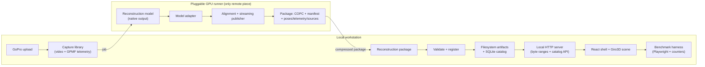

# Visualization Platform — Feature & Architecture Plan (v2)

Status: **accepted — Phase 2 complete**
Date: 2026-07-25
Supersedes: plan v1 (2026-07-19) and `visualization_platform_plan_review.md` (2026-07-24). Decisions below were agreed after a third verification pass against the working tree and a mid-2026 survey of the renderer/format ecosystem.

## Product goal

Record a POV video (GoPro today; other sensors years away), upload it, and explore a responsive reconstructed 3D map of where you went. Spatially distant reconstructions — for example Yosemite and a hometown several hours away — must remain discoverable and navigable in one webpage. This is a personal mapping project, local-first by design.

North star: *start from a regional/world overview, locate any mapped place, enter the best available reconstruction, fly through it smoothly from coarse to fine detail, and inspect any region back to its source capture/run — without a page reload.*

Priorities, in order:

1. **Fast and responsive** — progressive LOD streaming, no blocking loads, interactive under 100M+ point artifacts.
2. **Correct** — explicit coordinate frames; unaligned data must never silently render at a GPS marker as if georeferenced.
3. **Provenance** — every point traceable to a capture/run/window via a compact source index.
4. **Model-agnostic** — reconstruction research is ongoing (MUSt3R, VGGT, DA3-streaming, ORB-SLAM, possibly 3DGS); the viewer consumes a canonical package, never model-native output.

The experiment-review surface (thresholds, per-window inspection, run comparison) is **transitional scaffolding**: build it thin and deletable, not as the product's information architecture.

## Decisions (summary)

| # | Decision | Choice |
| --- | --- | --- |
| D1 | Renderer | **Giro3D (three.js) inside the existing React shell.** Fallback: plain three.js + NASA `3d-tiles-renderer`. deck.gl viewer kept only as the pre-migration baseline measurement, then deleted. |
| D2 | Canonical point format | **COPC/LAZ near the origin:** aligned artifacts use local topocentric ENU; unaligned artifacts retain their declared native-local frame. LAS scale is 0.001 and offset is 0 for metric geometry. |
| D3 | Georeferencing | Float64 anchor + PROJ pipeline + ENU→ECEF 4×4 in the manifest. Viewer applies world placement as a scene-graph matrix. Re-alignment = manifest edit, never a re-tile. UTM/geographic exports are derived, on-demand representations for external tools. |
| D4 | Package contract | `manifest.json` + typed artifact list. **No required geometry slot** — points publish COPC, a future splat run publishes 3D Tiles+SPZ, a pose-only run publishes neither. |
| D5 | Serving | Static, range-readable files (COPC is its own tiling/LOD protocol) + a small SQLite-backed catalog API. No point parsing or reprojection on any view request. |
| D6 | Provenance | LAS `PointSourceId` (uint16) identifies a generic source unit → `sources.json`; `ContributorCount` records consolidation multiplicity and `Confidence` is optional. |
| D7 | Deployment | Local-only. The single remote boundary is a pluggable GPU reconstruction runner. Reference-data downloads (USGS 3DEP) exist **only** in the experimentation/QA workstream, never in the viewer path. |
| D8 | Temporal compare | August-vs-December A/B, timelines, and change views are **out of the first release**, gated on loop closure (today they would mostly visualize accumulated drift). |
| D9 | Multi-site navigation | **One application and viewport with overview/detail renderer modes.** The ECEF globe supplies basemap, footprints, and markers; selection cross-fades to a separately owned, origin-centered detail scene. Returning restores the overview camera. |

### Renderer rationale (condensed)

The product is a 3D scene you move through, not analytic data draped on a map — a 3D-engine problem. Giro3D provides, today and production-proven: native COPC octree traversal with screen-space-error refinement, byte-range fetches, worker LAZ decode, point budgets and eviction; attenuated point sizing, colormaps, classification/multi-attribute coloring; point picking; terrain/COG and 3D Tiles (via `3d-tiles-renderer`); and a plain-three.js escape hatch for custom materials/post-processing. deck.gl's `PointCloudLayer` has no hierarchy (the current 100k-point cap is that ceiling); its COPC support (loaders.gl 4.4, May 2026) is weeks old; its controllers are map controllers, not scene-exploration controllers; and it has no Gaussian-splat story. If reconstruction research lands on 3DGS, the splat ecosystem (3D Tiles 1.1 + `KHR_gaussian_splatting` + SPZ, Spark renderer, local PLY→tiles converter) is three.js-native, and Giro3D exposes the underlying `TilesRenderer` plugin system — same scene, one renderer family for both geometry futures.

Known risk: Giro3D shipped three breaking majors Oct 2025–Mar 2026. Mitigation: the renderer-neutral contract below is mandatory, and the Phase 2 spike validates on real Mapper data before the ADR is finalized.

## Target architecture



### Data flow at view time

```text
COPC file (static, local)
  └─ Giro3D COPCSource: octree hierarchy → frustum cull → screen-space-error refine
       → fetch selected byte ranges → worker LAZ decode → GPU upload
Catalog API (SQLite): captures / runs / artifacts / layer defaults / source lookup
Manifest: artifact-local→ECEF float64 transform → rebased for the active detail origin
```

No backend touches point data on a view request. The current hex-in-JSON path (`viewer/backend/data_service.py`) receives **zero further engineering effort**; it is replaced, not repaired.

### Control plane vs data plane

- **Control plane (small JSON):** search captures/runs/artifacts by bbox/time/status; fetch manifests and representations; fetch source/provenance records.
- **Data plane (immutable bytes):** COPC (+ later GLB / 3D Tiles / COG) from a range-capable local server (FastAPI `FileResponse` with correct `Range`, cancellation, and cache headers is sufficient).

### Renderer-neutral contract

The React shell and the scene component communicate only through `renderers/contracts.ts`: layers in (artifact URI, transform, style, budgets), view state / selections / pick results out. Giro3D is a swappable dependency behind this boundary.

## Domain model

Stable opaque IDs; the UI never infers meaning from folder names.

| Entity | Meaning |
| --- | --- |
| `CaptureSession` | One recording event: time range, device, raw assets, telemetry, footprint |
| `ReconstructionRun` | One model/config/commit execution over capture(s), with status + metrics |
| `SpatialArtifact` | A logical result (point cloud, mesh, splats, track, DEM) with bounds, frame, quality, lineage |
| `Representation` | A concrete encoding of an artifact (canonical COPC, derived UTM LAZ, 3D Tiles…) — versioned, reproducible, garbage-collectable |
| `LayerDefinition` | Presentation defaults for an artifact (style, filters, visibility) |

Catalog: JSON manifests on disk, indexed by SQLite (+R-tree). No PostGIS/object storage/auth until a concrete local need exists.

## Reconstruction package v1

The stable contract between reconstruction research and the viewer. Model adapters accept arbitrary native output and emit as much of this as the model supports:

```text
reconstructions/{run_id}/
  manifest.json                # required
  geometry/
    points.copc.laz            # typed artifact — present for point-based models
    splats-3dtiles/            # typed artifact — present if/when a 3DGS run is published
    mesh.glb                   # optional
  cameras/poses.parquet        # timestamp, frame index, txyz, quat xyzw, intrinsics (plain Parquet)
  telemetry/{gps,imu}.parquet
  sources.json                 # source_index -> capture / run / window / frame range
  metrics.json                 # reconstruction + alignment + publication metrics
  raw/                         # optional retained native output (configurable during research)
```

`manifest.json` records: schema version, ids, model/version/config/commit, adapter+publisher versions, checksums; every frame and named transform (units, axes, handedness, pose convention); artifact entries (kind, format, path, frame, bounds, counts, required dimensions); alignment method/inliers/RMSE/quality status; lossy operations (voxel size, in/out counts).

### Coordinate frame contract

For an aligned package, `artifact_local` is metre ENU at the declared WGS84
origin. For an unaligned package, `artifact_local` is the model's declared
native-local frame; its units may be unknown/non-metric and no geographic
placement fields are allowed.

```json
{
  "frame": "local_enu",
  "units": "metre",
  "axis_order": ["east", "north", "up"],
  "origin_wgs84": [lon, lat, ellipsoidal_h],
  "proj_pipeline": "+proj=pipeline +step +proj=cart +ellps=WGS84 +step +proj=topocentric ...",
  "transform_to_ecef": "row-major 4x4, float64",
  "alignment_status": "unaligned | approximate | aligned | reviewed",
  "horizontal_rmse_m": null,
  "vertical_rmse_m": null
}
```

Rules:

- LAS `scale = 0.001`, `offset = 0` → ±2,147 km at mm precision in the local frame; no per-file offset bookkeeping.
- An unaligned or non-metric artifact must not claim an EPSG CRS and must open in **local-scene mode** with a visible warning — never at a GPS marker.
- Vertical reference is ellipsoidal in the canonical frame. Orthometric conversion happens only in derived exports/QA, with a validation gate: assert the transform actually changed Z and `TransformerGroup.unavailable_operations == []` (PROJ silently no-ops when geoid grids are missing; vendor/pin the grid).
- Global catalog coordinates and ENU→ECEF transforms remain float64 on the CPU. Do not send state- or world-scale absolute coordinates directly to float32 point buffers and assume centimetre detail will survive. The viewer must rebase the render origin near the active site, or prove an equivalent high/low or camera-relative technique, while keeping URL/view/catalog state in the authoritative global frame.

### Model → world alignment (publisher-side, applied once)

```text
p_model --Sim(3)--> p_enu --anchor/basis--> p_ecef --PROJ (derived exports only)--> p_crs
```

1. GPS (WGS84) → ECEF → ENU anchored on a robust centroid of *quality-filtered* samples — extract GPMF `GPSF`/`GPSP`, reject `fix < 3` / high-DOP, never anchor on the first (pre-fix) sample.
2. Interpolate GPS to camera-pose **timestamps** (`CameraPoses.timestamps` already exists; never pair by index subsampling). Estimate GPS↔video clock offset by cross-correlating GPS speed with pose-derived speed; store offset + peak quality.
3. Robust weighted Umeyama/Kabsch with scale (arc-length ratio kept only as a reported diagnostic — it is upward-biased under noise). Metric models lock scale = 1.
4. Gravity as a **constraint**, not a post-multiplied correction: solve with `up` fixed and only yaw/translation(/scale) free, using per-sample gravity in the correct frame during low-motion windows.
5. `align()` returns an `AlignmentResult` (float64 transform, scale, method, inliers, RMSE, quality status, anchor) — persisted in the manifest. Reject and mark `unaligned` rather than publishing a convincing-but-wrong overlay.

### Provenance

- LAS `PointSourceId` (uint16) identifies the source
  unit emitted by reconstruction — a **window** today, or a SLAM
  submap/keyframe group/batch later. This makes drift and seams
  visible/selectable without baking the current VRAM workaround into the
  package contract.
- `sources.json` maps index → capture/run/source kind/frame range.
  Single-source artifacts may keep it at artifact level.
- Voxel consolidation provenance rule: the surviving point carries the
  highest-confidence contributor's `PointSourceId` plus `ContributorCount`.
  When `Confidence` is absent, selection is deterministic and no confidence is
  invented. The policy is recorded in the manifest.
- No UUIDs on points; detailed multi-observation lineage goes to a sidecar table if ever needed.

## Publisher spec

- **Streaming, always:** consume source chunks → transform → voxel-consolidate
  → write canonical LAZ shards → build COPC with pinned Rust
  `copc-converter` v0.11.0 under an explicit memory budget. The wrapper
  validates and flattens its terminal paged hierarchy before atomic
  publication; this preserves out-of-core conversion while avoiding thousands
  of eager Giro3D hierarchy requests. Never materialize a merged in-RAM cloud.
  This also removes the merge-stage OOM that killed the most recent long run.
- **Voxel consolidation** is a recorded, lossy stage only for geometry known to
  be metric (configurable target spacing, default 2–3 cm). It is skipped for
  unknown/non-metric native coordinates because centimetres would be
  meaningless. For metric windowed captures it is a *viewer-quality* feature
  as much as a storage one: coincident points make coarse LOD nodes render as
  thick fuzz while consuming the point budget.
- Point dimensions — required: XYZ (+RGB when available), `PointSourceId`, and
  `ContributorCount`; recommended and optional when the model supplies it:
  `Confidence`. Time, normals, and class remain optional.
- Confidence fixes are **per-model**: MUSt3R's adapter must stop round-tripping through a thresholded PLY (`_extract_pointcloud`) and pull points/colors/confidence off the scene object; VGGT already carries confidence in memory and loses it at `save_ply` — its fix is in the publisher path. Threshold-family PLYs stop being produced once confidence is a dimension.
- Validation gates: finite values, bounds, point counts, checksums, source-index distribution, vertical-transform sanity, publisher version stamped in the manifest.
- Runs next to the GPU job when practical (download compressed COPC, not multi-GB PLY); identical code path available locally for migration and debugging.

## Viewer (v1 scope)

React shell (kept) + Giro3D scene component:

- **Multi-site overview → detail** — one application and viewport cross-fades
  between an ECEF overview renderer and an origin-centered detail renderer. It
  can show catalog footprints/markers over a regional basemap and enter each
  reconstruction without a page reload.
- **Spatially lazy layer lifecycle** — query the SQLite spatial index by view bounds; at overview zoom render only catalog footprints/markers. Create a reconstruction's `COPCSource`/entity only when selected or inside a distance/zoom threshold, and dispose/evict it after leaving. Never initialize every catalog COPC at startup.
- **Precision-preserving world placement** — preserve the package's float64
  artifact-local→ECEF transform and render detail with
  `T(-active_origin_ecef) × M_artifact_to_ecef`. Geometry and trajectories use
  the same relative matrix; unaligned packages open in native-local detail
  with a rejection warning and cannot appear as geographic markers.
- **Progressive, non-blocking loading** — map stays interactive; per-layer progress; coarse-to-fine visible; offscreen requests abort.
- **Layer stack** — visibility, opacity, point budget, color mode (RGB / elevation / confidence / source index).
- **Inspector** — pick a point/region → source window/capture/run, confidence, alignment status; camera trajectory display from `poses.parquet`.
- **Local-scene vs geospatial mode** — explicit, with the unaligned warning.
- **URL-serializable state** — viewport, layers, selection.
- **Perf HUD** behind a flag (FPS, loaded nodes, decoded points, cache bytes).
- Restrained modern chrome: dark/light, consistent spacing/type, icons, no blocking global overlay.

Transitional (thin + deletable): a runs panel that lists published packages and loads two side by side. Not part of the core IA.

Out of v1: timelines/A-B/change detection (D8), fusion/accepted composite maps, measurement tools beyond a scale bar/coordinate readout, hosting, auth, collaboration.

### Existing visualization paths — disposition

| Path | Disposition |
| --- | --- |
| `viewer/` React + deck.gl 8.9 | Product shell survives; deck.gl scene + hex backend replaced in Phase 2 after baseline capture |
| `scripts/ply_viewer/` | **Keep** as the zero-dependency local-frame debug viewer (say so in its README) |
| `viser` (model-side) | Keep for model debugging |
| `scripts/folder_visualizer.py` (dash/plotly) | **Deleted in Phase 2** after GTX 1070 Source-color acceptance; direct `dash`/`plotly`/`dash-bootstrap-components` deps removed (Open3D still brings Dash transitively) |

## Performance budgets & benchmark harness

Initial budgets (calibrate on the reference machine; derived, not asserted):

| Metric | Budget |
| --- | --- |
| First coarse geometry | <1 s warm local, <2.5 s cold for the large fixture |
| Interaction | p95 frame time <20 ms while moving; no repeated >50 ms main-thread tasks |
| Visible points | 1–3 M to start, tuned from measured frame time |
| Client geometry cache | 256 MB starting cap (measured, adjustable) |
| Request behavior | Abort offscreen; bounded concurrency; visible-first priority |
| Backend | **Hard rule:** no point parsing/reprojection on any view request |

Harness (`benchmarks/viewer/`): Playwright/CDP replaying fixed camera paths over checksummed fixtures (small / medium / 100M+); app marks (catalog loaded, hierarchy loaded, first geometry, target refinement, idle); renderer counters (nodes loaded/visible, bytes ranged, decoded/drawn points, worker decode time, cache estimate); frame-time histograms + long tasks, never mean FPS; results as JSON per commit with machine/browser identity. Include a multi-site fixture with two georeferenced COPCs hundreds of kilometres apart: overview → site A → overview → site B, asserting correct placement, stable close-range precision, URL-serializable navigation, and no detailed COPC requests for the inactive distant site. Publisher stats (wall clock, bytes, points in/out) recorded per publish. Reconstruction-quality benchmarks stay separate, linked by `run_id`.

**Reconstruction-error QA (experiments workstream, not the viewer):** compare published artifacts against USGS 3DEP DEM/lidar for the Mission Peak capture area → real `vertical_rmse_m`, horizontal registration error, and drift-vs-distance along the trail. One-time, cacheable reference downloads; populates the manifest's alignment-quality fields with an independent source of truth.

## Repository structure (grow into; no empty folders in advance)

```text
viewer/
  frontend/src/
    app/                  # routing, URL state, stores
    domain/               # capture/run/artifact/layer types
    features/             # catalog, layer-stack, inspector, runs-panel (transitional)
    renderers/
      giro/               # scene component
      contracts.ts        # renderer-neutral boundary
    data/                 # api client + adapters
  backend/
    api/                  # catalog routes + range-capable asset serving
    domain/ services/ adapters/   # SQLite catalog, blob store, gpu_runner
src/publisher/
  cli.py  pipelines/  validation/
schemas/                  # package + manifest JSON schemas (written descriptively in Phase 1)
benchmarks/viewer/
```

## Roadmap

### Phase 0 — Spike (~2–4 days, no committed code)

> Progress: **complete — Giro3D accepted** — conversion, validation, traversal, visual
> comparison, consolidation curve, baseline, manifest inventory and GTX 1070 frame-time
> calibration are complete. The selected starting point is a 2M point budget, SSE 1 and
> source decode stride 2; see
> [`phase0_spike_findings.md`](phase0_spike_findings.md). Tooling:
> [`spike/phase0/`](../spike/phase0/).

Answer the biggest question before designing around it:

1. Convert `mp7` (146.9M pts, ~2.1 GB PLY) → COPC. The Phase 0 spike
   evaluated the format; the production path adopted in Phase 1 uses bounded
   LAZ staging plus pinned Rust `copc-converter` v0.11.0 and flattens its
   terminal paged hierarchy before publication.
2. Serve via `python -m http.server`; load in Giro3D's **stock** COPC example. Judge time-to-first-geometry, refinement, memory, and how flying through it feels.
3. Repeat with a ~2 cm voxel-consolidated variant; compare visual quality and node counts (measures the real redundancy factor).
4. Write down every field a manifest needed to make 1–3 reproducible → schema v1 first draft.
5. Baseline the current deck.gl viewer (load time, memory, frame time) as the "before" record; fix `pytest` collection (`testpaths = ["tests"]`).

Exit: Giro3D traverses Mapper COPC within budget on this machine, or we know why and pivot to the three.js fallback.

### Phase 1 — Correctness + canonical publisher — **complete**

Completed 2026-07-25. Acceptance evidence and deliberate boundaries are recorded
in [`phase1_review.md`](phase1_review.md).

Delivered: (1) `AlignmentResult` — nothing durable is written before it; (2)
timestamped GPS↔pose pairing + Umeyama + GPS fix-quality filtering + robust
anchor + clock-offset estimate; (3) removal of unused threshold PLYs and
duplicate window re-saves; (4) per-model confidence preservation; (5)
bounded-memory publisher from generic source units through metric-aware voxel
consolidation to COPC with source provenance; (6) strict manifest/package schema
v1; (7) SQLite catalog with a WGS84 spatial index plus a range-capable asset
endpoint; (8) legacy PLY migration CLI; and (9) configurable data roots.

Exit: **passed.** MUSt3R and VGGT publish the same package contract; the
146.9M-point artifact converts under the publisher memory budget without
entering the viewer request path; every manifest has explicit alignment
quality; and catalog tests prove that georeferenced packages are returned by
global-footprint queries while unaligned packages are excluded. Fresh
model-to-package runs, COPC checksums, writer benchmarks, and verification
results are captured in the Phase 1 review.

### Phase 2 — Viewer integration (1–2 weeks) — **complete**

Giro3D components behind `contracts.ts`; catalog-driven layer stack and
spatially lazy entity lifecycle; an ECEF regional overview plus an
independently owned origin-centered detail renderer; picking + inspector wired
through `PointSourceId` to `sources.json`; delete the hex path; run benchmark
scenarios; tune subdivision/point budget; and finalize the renderer decision
in ADR-005.

Exit: the 146.9M-point artifact opens progressively within budgets; two runs toggle without leaving budget; two georeferenced reconstructions hundreds of kilometres apart are located from one overview and visited without a page reload, close-range geometry remains stable after the transition, and the inactive distant site's detailed COPC nodes are not fetched; old data path deleted.

### Phase 3 — GoPro→map vertical slice (2–4 weeks)

Local ingest → capture record → telemetry extraction → GPU-runner adapter (submit/status/download) → validate/register → auto-open. Clear failure/retry states at each boundary.

Exit: selecting a GoPro video ends in a progressively viewable map with no manual file handling.

### Phase 4 — Research loop (ongoing)

One adapter per model; native output retained under `raw/`; runs compared through the common package; 3DEP error QA; splat hedge validated when a 3DGS run warrants it (local PLY→3D Tiles+SPZ converter → `Tiles3D` splat plugin inside the same scene).

### Later

Loop closure → then temporal layers/comparison; fusion + accepted composite maps; meshes/terrain derivatives; semantics.

## Non-goals (first release)

Timelines/A-B/change detection (gated on loop closure); global fused "single truth"; hosted/cloud anything beyond the GPU runner; published-lidar display in the viewer; learned layer ranking; PostGIS/Redis/K8s; per-point SQL from the browser; a visual rewrite before delivery correctness.

## Risks

| Risk | Mitigation |
| --- | --- |
| Giro3D API churn (3 majors in 6 months) | Renderer contract boundary; spike before ADR; three.js-direct fallback in-family |
| Wrong-but-plausible georeferencing | Frame contract + validation gates + local-scene mode + 3DEP error QA |
| Publishing loses confidence/provenance | Schema tests; point-count and source-distribution checks per conversion |
| LOD looks fuzzy on redundant data | Voxel consolidation stage; Phase 0 step 3 measures it before commitment |
| 3DGS wins the model race | Typed artifact list (D4); 3D Tiles+SPZ path in the same renderer family |
| Derived-format sprawl | Committed set now: COPC, Parquet, JSON+SQLite. PMTiles/STAC/3D Tiles only when a need names them |

## Decision log

- ADR-001 identity/manifest schema — **accepted**
- ADR-002 local ENU canonical frame + float64 transform chain — **accepted (D2/D3)**
- ADR-003 COPC + extra dimensions; typed artifact list — **accepted (D2/D4)**
- ADR-004 direct COPC serving + LOD policy — **accepted (D5)**
- ADR-005 two-mode Giro3D renderer — **accepted**
- ADR-006 SQLite catalog layout — **accepted**
- ADR-007 provenance through consolidation/fusion — **accepted**

## References

- [COPC spec](https://copc.io/) · [copc-converter](https://github.com/360-geo/copc-converter)
- [Giro3D COPCSource](https://giro3d.org/latest/apidoc/classes/sources_COPCSource.COPCSource.html) · [Giro3D releases](https://gitlab.com/giro3d/giro3d/-/releases)
- [3d-tiles-renderer](https://github.com/NASA-AMMOS/3DTilesRendererJS) · [3DGS 3D Tiles plugin](https://github.com/WilliamLiu-1997/3D-Tiles-RendererJS-3DGS-Plugin) · [3DGS PLY→3D Tiles converter](https://github.com/WilliamLiu-1997/3DGS-PLY-3DTiles-Converter)
- [PROJ topocentric conversion](https://proj.org/en/stable/operations/conversions/topocentric.html)
- [USGS 3DEP](https://www.usgs.gov/3d-elevation-program) (experiments/QA only)
