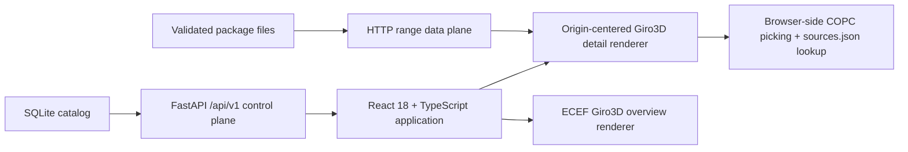

# Mapper reconstruction viewer

The Phase 2 viewer is one React application and viewport with two renderer
modes:

- an ECEF Giro3D globe for catalog footprints and lightweight markers; and
- an origin-centered Giro3D detail scene for COPC geometry, trajectories,
  picking, and provenance inspection.

The modes cross-fade without page navigation. Selecting an aligned artifact
uses its authoritative float64 artifact-local-to-ECEF transform while rendering
relative to the active site origin. An unaligned artifact opens only in its
native-local frame and displays its alignment rejection reason.

## Architecture



The backend serves catalog metadata, manifests, sidecars, and immutable
range-readable assets. It never parses, downsamples, or reprojects points on a
view request. The browser owns COPC traversal and LAZ decoding.

## Configuration

Backend:

```bash
export MAPPER_CATALOG_PATH=/home/ape/mapper_output/phase1_fresh/catalog.sqlite3
export PORT=8000
```

Frontend variables are read by Vite:

```bash
export VITE_API_ROOT=http://127.0.0.1:8000
export VITE_BASEMAP_ENABLED=true
export VITE_BASEMAP_URL='https://tile.openstreetmap.org/{z}/{x}/{y}.png'
export VITE_BASEMAP_ATTRIBUTION='© OpenStreetMap contributors'
```

Set `VITE_BASEMAP_ENABLED=false` for a network-isolated session. Terrain,
offline basemap packaging, hosting/auth, temporal comparison, bulk legacy
migration, and SLAM reconstruction are outside Phase 2.

## Run

Install the backend and frontend dependencies once:

```bash
cd viewer
python -m venv venv
venv/bin/pip install -r requirements.txt
cd frontend
npm ci
```

Then start both processes:

```bash
./viewer/start.sh
```

This defaults to the persistent five-artifact catalog at
`/home/ape/mapper_output/phase1_fresh/catalog.sqlite3`. Use
`./viewer/start.sh --production` for an optimized build,
`./viewer/start.sh --no-basemap` for a network-isolated session, and
`./viewer/start.sh --help` for port, host, and catalog overrides.

Or run them separately from the repository root:

```bash
.venv/bin/python -m viewer.backend.server
cd viewer/frontend && npm run dev
```

The frontend is at `http://127.0.0.1:5173`, the API is at
`http://127.0.0.1:8000`, and generated OpenAPI documentation is at
`http://127.0.0.1:8000/docs`.

## Data and lifecycle rules

- Overview bbox queries are debounced by 150 ms and split at the
  antimeridian.
- Manifest and representation details are fetched only after selection.
- Overview never initializes a COPC source.
- Detail uses a two-million-point global budget, SSE threshold 1, decode
  stride 2, and 256 MB CPU/GPU geometry caps.
- At most two same-site detail COPCs share the budget. An artifact over 10 km
  from the active origin requires returning through overview.
- Leaving detail aborts in-flight requests and disposes sources, workers,
  cached node attributes, and geometry.
- `PointSourceId` resolves through `sources.json`; `ContributorCount` is always
  meaningful and `Confidence` controls are disabled when absent.

`scripts/ply_viewer/` remains the documented local-frame debugging tool. It is
not part of the product serving path.
